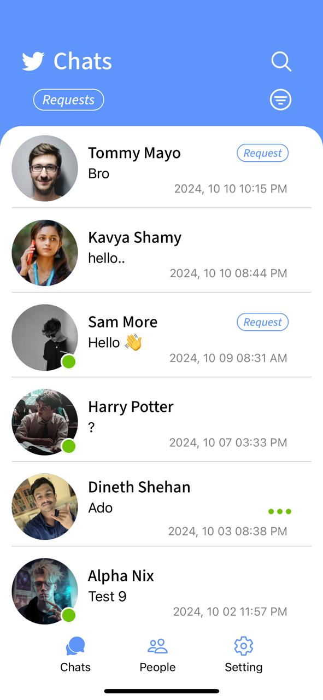

# 📱 React Native Chat App  

<div align="center">
   
   
</div>


A real-time chat application built with **React Native**, designed to provide seamless and engaging messaging experiences and share skills to got an opportunity to earn by  providing a service with your skills or share your knowledge and solve your problems on your mother language..

## 🚀 Features  
- **Real-Time Messaging:** Chat with friends and groups instantly.  
- **User Authentication:** Secure login and registration system.  .  
- **Profile Customization:** Edit profile details.
- **Chat Lock:** Lock a chat with your own pin.
- **Translation:** Translate messages into your native language
- **Search Users:** Search users by name or chat messages or skills
- **Send Request:** Send friend request for start chat with someone at first time

## 🛠️ Tech Stack  
- **Frontend:** React Native, Expo  
- **Backend:** Java
- **Database:** MySQL

## 📂 Project Structure  
```plaintext
📦 NativeSound 
├── 📁 app
├── 📁 assets
│   ├── 📁 annimations  
│   ├── 📁 fonts  
│   ├── 📁 images
├── .gitignore
├── app.json
├── babel.config.js
├── package-lock.json
├── package.json  
└── README.md  
```


## 🖥️ Installation & Setup  
1. Clone the repository:  
   ```bash
   git clone https://github.com/Navi9x/native-sound.git
   cd native-sound
   ```

2. Install dependencies:  
   ```bash
   npm install
   npx expo install @shopify/flash-list
   npm i react-native-vector-icons
   npx expo install @expo/vector-icons
   npm i react-native-element-dropdown
   npx expo install expo-media-library
   npm i react-native-dropdown-select-list
   npm i @kbaseit/kbase-react-native-dropdown-select-list
   npx expo install @react-native-picker/picker
   npm i react-native-language-select
   npm i lottie-react-native
   npm i react-native-dropdown-country-picker
   npx expo install expo-image-picker
   npx expo install expo-linear-gradient
   expo install react-native-safe-area-context
   npx expo install expo-font expo-splash-screen
   npm i react-native-phone-number-input
   npx expo install @react-native-picker/picker
   npx expo install react-native-screens expo-linking expo-constants expo-status-bar
   
   ```

3. Start the development server:  
   ```bash
   npx expo start
   ```

4. Open the app on your device:  
   - Scan the QR code using the Expo Go app.  
   - Or, run on an emulator with `npm run android` or `npm run ios`.    

5. Youtube short here: 
<div align="center">
<a  href="https://youtube.com/shorts/mEHvw9Qssk4?si=lvMY1IIHtAgTj1Lc" target="_blank">
  
</a>
</div>


## 🤝 Contributions  
Contributions are welcome! Please open an issue or submit a pull request if you’d like to improve the app.  

---

### 📧 Contact  
Feel free to reach out if you have any questions or feedback!  
- **Email:** navidurashoda@icloud.com 
- **GitHub:** [Navi9x](https://github.com/Navi9x)  

